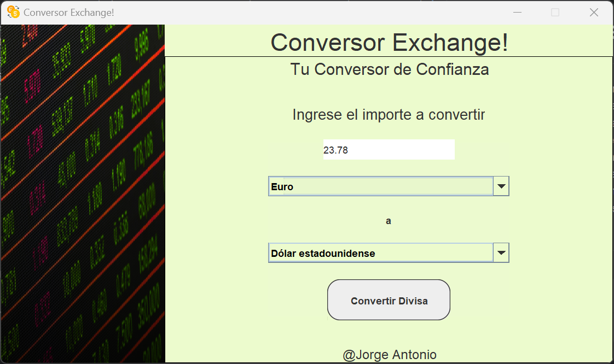
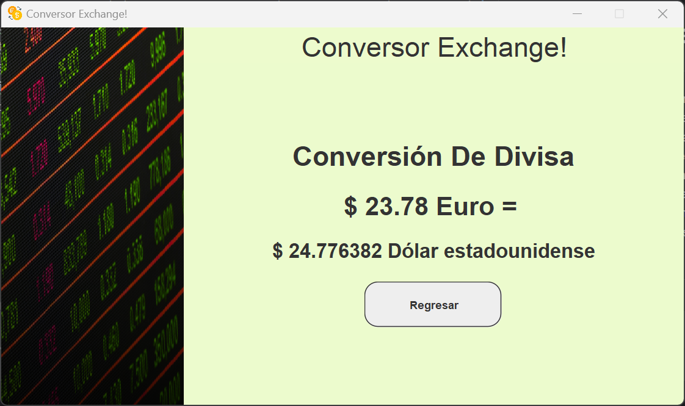

# Conversor de Divisa

---

Este proyecto es un Conversor de Divisas en Java que permite a los usuarios convertir montos entre 
diferentes monedas utilizando los tipos de cambio actualizados del día. 
El sistema se conecta a una API de tasas de cambio en tiempo real para obtener los 
valores más recientes, garantizando precisión en las conversiones. 
Además, incluye validaciones para manejar errores como falta de conexión a Internet, 
límites de solicitudes a la API y claves de API inválidas, 
ofreciendo una experiencia confiable y eficiente. 

---
### INCIO DE LA APLICACION

---

### CONVERSION DE DIVISA

---

### NOTA IMPORTANTE:
Para que este conversor de divisas funcione correctamente, 
es necesario obtener una API Key de la página ExchangeRate API. 
Sigue estos pasos:

1. Regístrate en ExchangeRate API y genera tu API Key personal.
2. Una vez que tengas la API Key, crea un archivo llamado .env en el directorio principal de la aplicación.
3. Dentro del archivo .env, agrega la siguiente línea, reemplazando TU_API_KEY con tu clave generada:
    >api_key=TU_API_KEY

Este archivo permitirá que la aplicación acceda a la clave para realizar las solicitudes a la API y obtener los resultados de conversión actualizados. 
Asegúrate de no compartir tu archivo .env ni tu API Key públicamente para proteger la seguridad de tu cuenta.
Además de que deberas configurar las variables del entorno del compilador para que tome este archivo en cuenta.